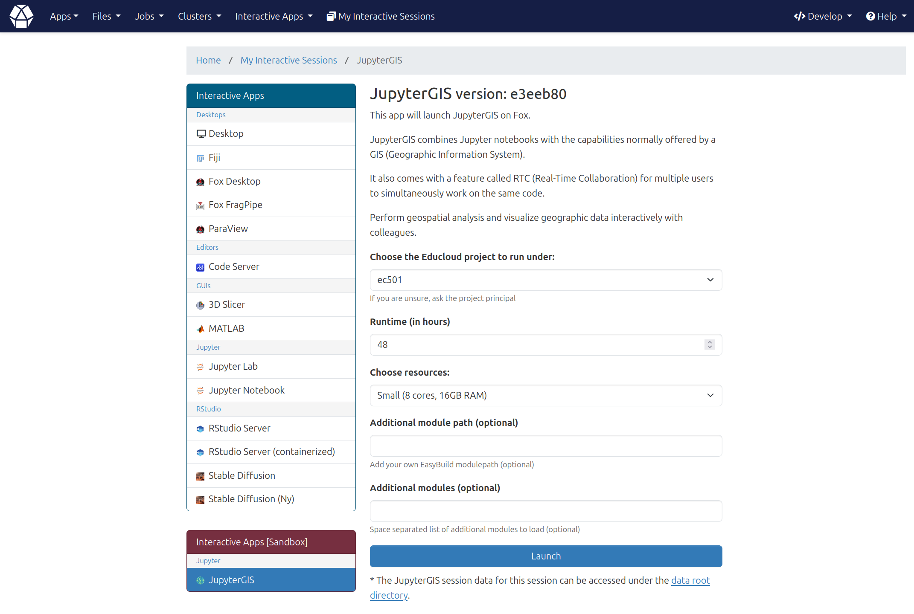

# jupytergis-ood
JupyterGIS deployment for Open OnDemand

# For use on https://ondemand.educloud.no/

- Create an `ondemand/dev`folder in your `$HOME` directory on Fox

- Clone this repository into a new folder called `JupyterGIS` using

```
git clone https://github.com/j34ni/jupytergis-ood.git JupyterGIS
``` 

and `cd` into it with `cd $HOME/ondemand/dev/JupyterGIS`

- Copy the content of the `Educloud` folder in the current directory

- Pull the container image from Quay.io, for instance for the latest version:

```
apptainer pull docker://quay.io/jeani/jupytergis-ood:latest
```

- Remane the Singularity Image File as `jupytergis-ood.sif` (`mv jupytergis-ood_latest.sif jupytergis-ood.sif`
  
*Make sure to use the recommended folder and image names, since these are used in `$HOME/ondemand/dev/JupyterGIS/template/script.sh.erb`, if not update `APPTAINERIMAGE`*

- Log into `https://ondemand.educloud.no` and you should see `Interactive Apps [Sandbox]` with the `JupyterGIS` on the left side menu, under the `Interractive Apps`, click on it


  
- Choose your `Educloud project`, `Runtime (in hours)`, allocated `Resources` and **Launch**

# For use on https://apps.betzy.sigma2.no

Proceed as above but use the content of the `Betzy` folder instead of `Educloud` (to configure the batch script and submission arguments for job execution̉̉̉̉̉̉̉̉̉̉ accordingly).
